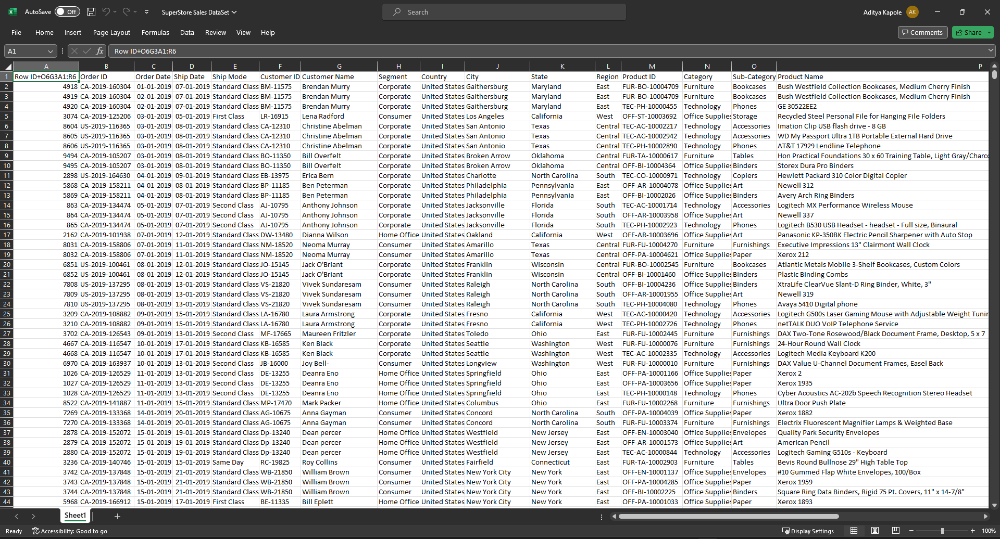
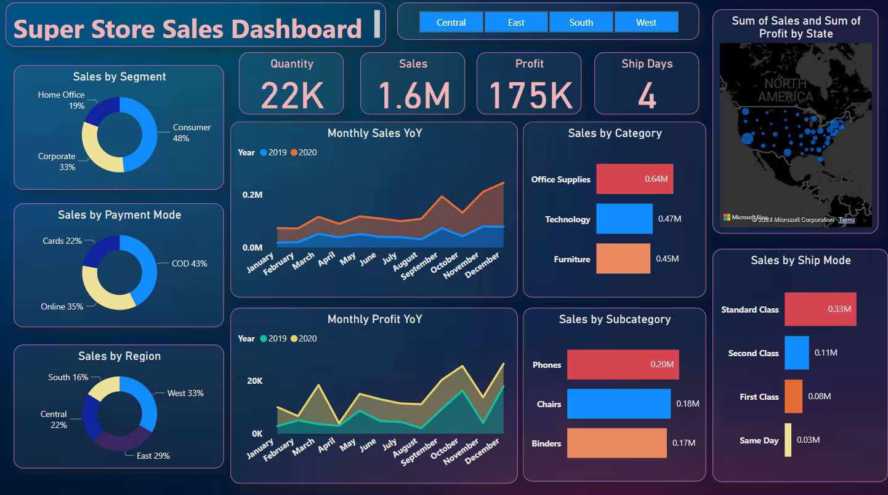
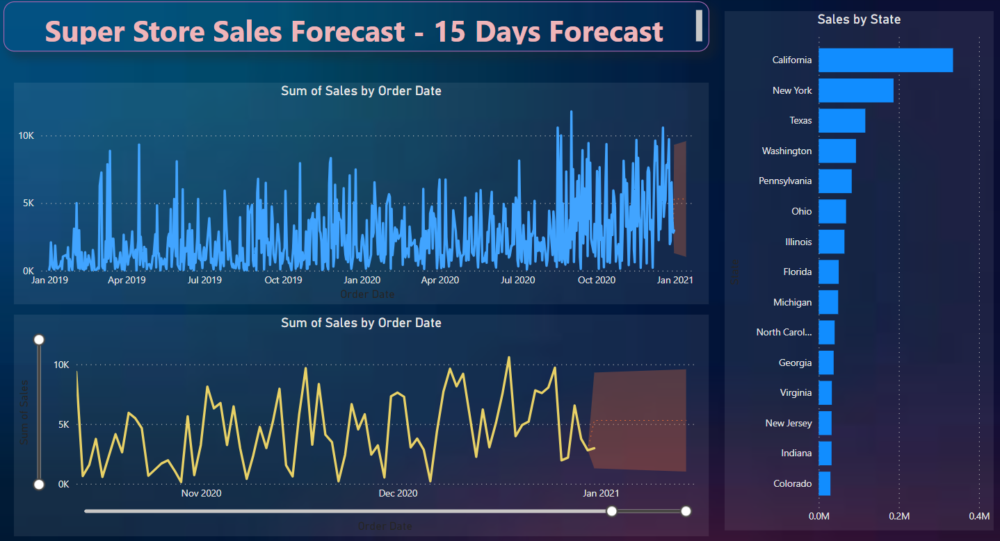

# SuperStore_Sales_Analysis

## Overview

This repository contains a PowerBI dashboard designed for analyzing and visualizing sales data for a store. The dashboard provides key insights into sales performance, trends, and other relevant metrics, allowing users to make informed business decisions.

## Features

- **Interactive Visualizations:** Engage with dynamic and interactive visualizations to explore sales data from various perspectives.
- **Filtering and Slicing:** Utilize filters and slicers to narrow down the data based on specific criteria, enabling detailed analysis.
- **Key Metrics:** Track essential metrics such as total sales, profit, and product category performance at a glance.
- **Customer Segmentation:** Gain insights into customer behavior through segmentation analysis, helping tailor marketing strategies.

## Getting Started
- Download and open the sales_dashboard.pbix file using PowerBI Desktop.
- Interact with the various charts, graphs, and tables to explore the sales data.
- Experiment with different filters and slicers to customize the view.

## Data Collection
For this Power BI Dashboard project, the dataset was sourced from Kaggle, providing a readily available and convenient starting point. As a beginner, this approach allowed for quick access to a sample dataset without the need for extensive data collection skills.. The chosen dataset is the Sample SuperStore dataset, offering a diverse set of sales-related information for analysis.

## Analysis and Visualizations
The goal of this visualization project is to delve into the sales performance of a store. The project seeks to offer a thorough insight into sales trends, regional contributions, product performance, and customers within the specified timeframe. The primary objective is to provide a comprehensive understanding of the store's sales dynamics.

## SuperStore Sales Dashboard

## SuperStore Sales-15 Days Forecast

